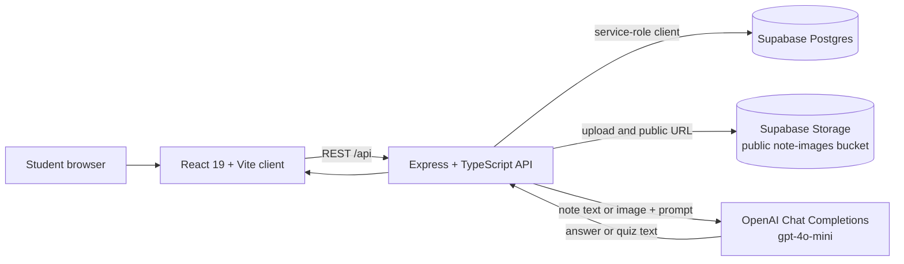
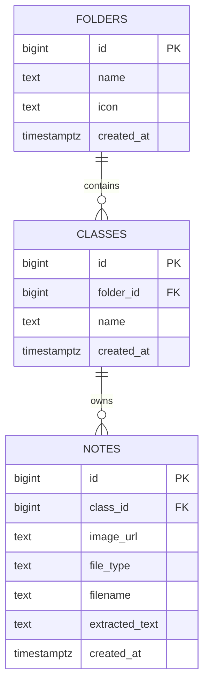
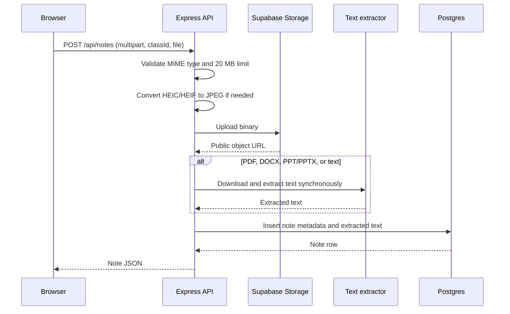
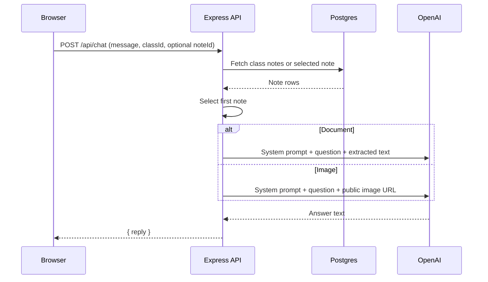
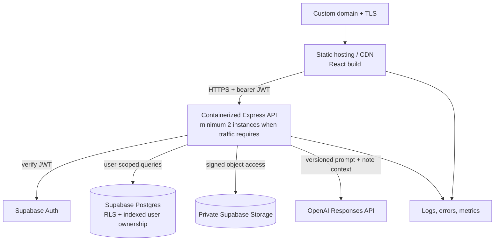
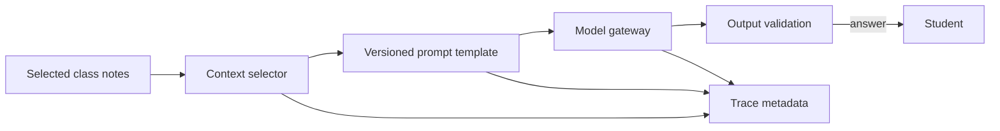
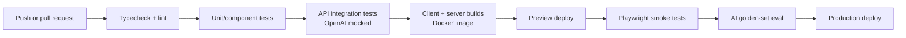

# ShelfStudy system architecture

This document describes the system that exists today, the production shape it
should evolve toward, and the engineering trade-offs behind that path. It is
written to be useful both as an implementation guide and as an interview
discussion outline.

## 1. Product and architectural thesis

ShelfStudy is an AI-assisted study workspace. A student organizes classes,
uploads source material, and asks for explanations or quizzes grounded in those
notes.

The right near-term architecture is a **modular monolith**:

- one React client;
- one Express API;
- one managed Postgres and object-storage provider;
- one external model provider.

That gives the project clear component boundaries without adding operational
cost from microservices, Kubernetes, a message bus, or a separate vector
database before the workload justifies them.

The most important architectural boundary is trust:

- the browser is untrusted and receives only a user-scoped access token;
- the API owns privileged data access and OpenAI credentials;
- uploaded notes are untrusted model context;
- development automation can access the repository, but is never part of the
  deployed request path.

## 2. Current system



### Current runtime responsibilities

| Component | Owns | Does not own |
|---|---|---|
| React client | Routing, UI state, folder/class/note interactions, in-memory chat history | Secrets, authorization, durable chat state |
| Express API | Validation, CRUD orchestration, uploads, extraction, OpenAI calls | User identity, background jobs, durable observability |
| Supabase Postgres | Folders, classes, note metadata and extracted text | Current per-user isolation |
| Supabase Storage | Uploaded note binaries | Private signed access today |
| OpenAI | Grounded answer and quiz generation from provided note context | Source-of-truth storage or authorization |

### Current API surface

```text
/api/folders     folder CRUD
/api/classes     class CRUD and folder assignment
/api/notes       upload, list by class, fetch, delete
/api/chat        grounded question answering
/api/chat/quiz   quiz generation
```

The API is intentionally resource-oriented. The AI routes are actions rather
than CRUD resources because they invoke model inference instead of storing a
durable entity.

## 3. Core data model



Important deletion behavior:

- deleting a folder sets `classes.folder_id` to `NULL`;
- deleting a class cascades to its note rows;
- the current note deletion route deletes metadata but does not call the
  existing storage deletion helper, so orphaned objects are possible.

RLS is enabled with no browser-facing policies. That is safe only because the
browser does not access the database directly; the Express server uses the
Supabase service-role key and therefore bypasses RLS.

## 4. Important request flows

### Upload and extraction



This synchronous design is simple and correct for the current scale. Its first
scaling pressure will be request timeouts and API memory usage during large
document extraction, not database throughput.

### Grounded chat



The answer is grounded only in one note today. That keeps the implementation
small, but it is not yet a class-wide retrieval system. Chat messages also live
only in React memory and disappear on reload.

## 5. Production deployment target

The first deployment should remain a modular monolith:



### Recommended first platform

Use **Render** for the first deployment:

- static site for the Vite build;
- containerized web service for Express;
- Supabase remains managed separately;
- environment variables stored in the service configuration;
- deploy the API only after typecheck, tests, and image build pass.

The exact provider is replaceable because the API should be delivered as a
standard Docker image. Railway or Fly.io remain reasonable alternatives; the
architecture should not depend on provider-specific runtime APIs.

### Environment layout

| Environment | Purpose | Data policy |
|---|---|---|
| Local | Fast development and Playwright work | Developer Supabase project or local stack |
| Preview | Branch/release validation | Isolated non-production data and keys |
| Production | Real users | Production Supabase, private storage, restricted secrets |

Never point visual regression or automated mutation checks at production data.

## 6. Authentication and authorization

Supabase Auth is the natural choice because Supabase already stores the data.

Target request path:

1. The client signs in through Supabase Auth.
2. It sends the access token to Express as a bearer token.
3. Express verifies the JWT and derives `user_id`; it never accepts a user ID
   supplied by the browser as authorization evidence.
4. `folders`, `classes`, and `notes` gain `user_id` ownership, directly or
   through a trusted parent relationship.
5. Every query is user-scoped, and RLS provides defense in depth.

The service-role key stays server-only. A production client bundle must never
contain it.

Recommended authorization invariant:

```text
authenticated user
  -> owns folder
    -> owns every class in that folder
      -> owns every note in that class
```

This makes authorization easy to reason about and test. Sharing and
collaboration should be a later, explicit data-model feature rather than an
exception hidden inside ownership checks.

## 7. AI subsystem

### Current pipeline

```text
note row -> document text or image URL -> inline prompt -> gpt-4o-mini -> text
```

### Production-ready pipeline



The model gateway should record:

- model ID returned by the provider;
- prompt version;
- context note IDs;
- latency and success/failure;
- input, cached, output, and reasoning tokens when available;
- estimated or reported cost;
- request/trace ID, without logging raw private notes by default.

### Context strategy

Do not add a vector database immediately. First improve deterministic context
selection:

1. explicit selected note;
2. otherwise all class notes while they fit a measured token budget;
3. summarize or chunk only after representative classes exceed that budget;
4. add embeddings and retrieval when evals show that full-context cost or
   relevance is the limiting factor.

This avoids building RAG infrastructure before the data demonstrates a need.

### Prompt lifecycle

Move inline prompts into versioned modules such as:

```text
server/src/prompts/chat/v1.ts
server/src/prompts/quiz/v1.ts
```

A prompt change is then treated like a model change:

1. run a representative golden dataset;
2. compare task success, groundedness, latency, and cost;
3. deploy with the prompt version attached to traces;
4. retain a rollback path.

### Evaluation set

Start with 20–30 curated cases, not hundreds of weak examples:

- factual answer present in a note;
- answer absent from notes;
- conflicting notes;
- handwritten or noisy image;
- long PDF;
- quiz formatting and answer correctness;
- prompt-injection text inside an uploaded note.

Score groundedness, completeness, refusal when evidence is missing, structured
format validity, latency, and cost per successful response.

## 8. Security and privacy

Current risks to fix before a public deployment:

- no authentication or user isolation;
- service-role access behind unauthenticated routes;
- public note objects;
- permissive CORS;
- no rate limiting;
- uploaded note content is passed to a model without explicit prompt-injection
  handling;
- no centralized request validation or security headers;
- raw error details can reach responses;
- storage objects can be orphaned from database rows.

Production controls:

- Supabase Auth plus server-side JWT verification;
- user ownership and RLS policies;
- private storage with short-lived signed URLs;
- origin allowlist, Helmet, body limits, and route rate limits;
- MIME sniffing and optional malware scanning for uploads;
- treat note contents as data, never as instructions;
- redact secrets and note contents from default logs;
- transactional or compensating cleanup for DB/storage changes;
- dependency and container-image scanning in CI.

## 9. Reliability and observability

Every API request should receive a request ID propagated to OpenAI trace
metadata and logs.

Minimum signals:

| Signal | Why it matters |
|---|---|
| Route latency, status, request count | Find slow or failing endpoints |
| OpenAI latency, error rate, token use, cost | Track the least deterministic dependency |
| Upload size and extraction duration | Detect memory/timeout pressure |
| Supabase query errors and duration | Identify data-layer regressions |
| Client exceptions and failed requests | Catch failures outside server logs |
| Eval pass rate by model/prompt version | Detect AI-quality regressions |

Start with structured JSON logs and an error tracker such as Sentry. Add a
metrics dashboard when deployment traffic exists. Do not introduce a large
observability stack before there is an environment to observe.

Failure behavior:

- time out upstream model calls;
- retry only transient, idempotent operations with bounded exponential backoff;
- do not retry validation failures;
- return a request ID with user-safe errors;
- add health/readiness endpoints that check process health separately from
  optional dependency health.

## 10. Testing and delivery



Test the contracts most likely to embarrass the product if broken:

- folder/class CRUD and ownership;
- note upload validation and cleanup;
- chat input validation and model-error mapping;
- folder rename/delete UI;
- workspace sidebar state;
- Playwright navigation through the reference screens;
- AI outputs against the golden dataset with provider calls mocked in ordinary
  CI and a controlled live-model evaluation before model/prompt releases.

## 11. Scaling triggers

| Pressure | First response | Later response only if measured |
|---|---|---|
| Upload requests time out | Move extraction to a background job | Separate worker service and queue |
| Note context exceeds budget | Chunk and deterministically select context | Embedding retrieval / vector index |
| Model latency dominates | Stream responses, tune prompts/model tier | Cache safe derived artifacts |
| API traffic grows | Horizontal API instances; stateless handlers | Split independently scaling workers |
| Database reads grow | Verify indexes and query plans | Read replicas/caching |
| Team/deploy complexity grows | Docker + CI + preview environments | Infrastructure as code |

What likely breaks first at 10× usage is synchronous document extraction and
unbounded model context—not React rendering or Postgres.

## 12. Deliberate non-goals

Do not add these until a measured requirement exists:

- microservices for folder, class, and note CRUD;
- Kubernetes;
- Kafka or a general event bus;
- a vector database before context/eval evidence requires it;
- a separate auth provider;
- autonomous multi-agent production workflows;
- fine-tuning before prompt, retrieval, and eval baselines are mature.

These are not missing sophistication. They are avoided operational burden.

## 13. Delivery sequence

Proposed sequence, to confirm before implementation:

1. Finish the UI rewrite and backend-wire the workspace.
2. Containerize client and server.
3. Add targeted automated tests.
4. Add blocking CI checks.
5. Add Supabase Auth, ownership, RLS, and private storage.
6. Extract/version prompts and add trace metadata.
7. Build the golden evaluation set.
8. Deploy preview and production environments.
9. Add production logging, error tracking, and the first dashboard.

Tests and CI come early so authentication, AI, and deployment changes land
behind a safety net.

## 14. Interview version

### 30-second summary

> ShelfStudy is a modular-monolith AI study app: a React/TypeScript client talks
> to an Express API, which owns privileged access to Supabase Postgres and
> Storage and sends selected note context to OpenAI. I chose that shape because
> it keeps trust boundaries and deployment simple at the current scale. The
> production roadmap adds Supabase Auth and RLS, private storage, versioned
> prompts, a golden AI eval set, containerized deployment, and observability.
> I have explicit triggers for adding background extraction or retrieval
> infrastructure, rather than starting with microservices or a vector database.

### Strong follow-up points

- **Why an API instead of direct Supabase from React?** It protects the
  service-role and OpenAI keys and centralizes validation and authorization.
- **Why no vector database yet?** The current workload uses one note; retrieval
  should be introduced only when token budgets and evals show a relevance or
  cost problem.
- **What breaks first at scale?** Synchronous file extraction and model
  context/latency, not CRUD throughput.
- **How do you prevent AI regressions?** Version prompts and models, trace the
  exact context, and gate changes with a curated golden evaluation set.
- **How do you handle prompt injection?** Uploaded notes are untrusted data,
  never instructions; prompts establish that boundary, tools remain
  allowlisted, and evals include adversarial note content.
- **Why a modular monolith?** It minimizes operational overhead while keeping
  boundaries clean enough to extract a worker when measured load requires it.

The strongest interview posture is to describe both what exists and what you
would change before production. Claiming planned controls as already built is
less impressive than showing that you can identify the current failure modes
and sequence the work responsibly.
