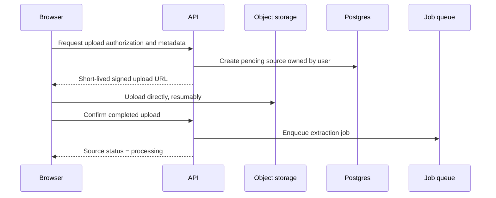
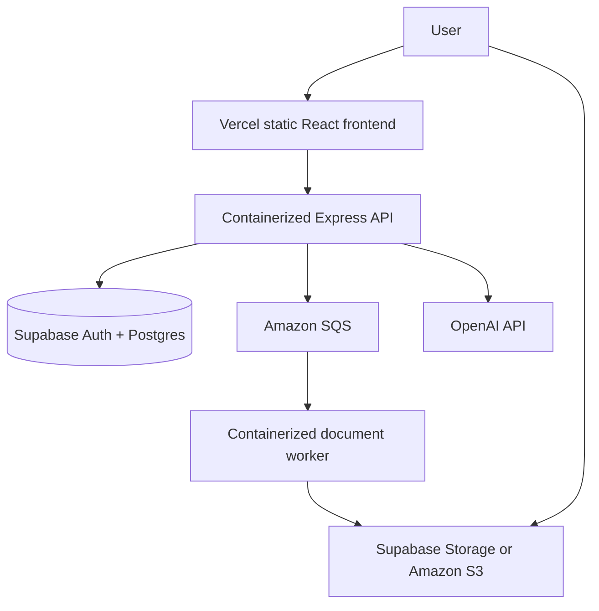

# ShelfStudy production roadmap

Last updated: 2026-08-30

This roadmap records the expected production direction. Complete and review one
phase at a time. Do not begin later phases automatically.

## Phase 0: finish the learning product

Current priority.

- Complete upload validation across every supported and invalid fixture.
- Verify previews for images, PDF, TXT, DOCX, PPT/PPTX, and in-app HTML notes.
- Complete grounded flashcard generation, regeneration, loading, and error states.
- Add focused automated tests for upload routes, preview generation, and mocked
  flashcard responses.

Exit condition: upload and flashcard behavior is reliable locally and protected
by tests.

## Phase 1: identity and isolation

- Add Supabase Auth.
- Add user ownership to folders, classes, notes, and generated study material.
- Enable row-level security and replace public file URLs with private storage.
- Issue short-lived signed download URLs.
- Add per-user storage and AI-generation quotas.
- Stop treating class and note IDs from the browser as authorization.

Exit condition: one user cannot read, modify, generate from, or delete another
user's data.

## Phase 2: direct and resumable uploads

- Remove large file bytes from the Express request path.
- Use Supabase signed/TUS uploads initially or S3 presigned multipart uploads if
  AWS object storage is selected.
- Track source state: `pending`, `uploaded`, `processing`, `ready`, or `failed`.
- Use unique immutable object keys based on user and source IDs.
- Add idempotency so retries do not create duplicate notes or overwrite objects.
- Delete abandoned pending uploads and incomplete multipart uploads.

Exit condition: simultaneous large uploads do not scale API memory linearly.

## Phase 3: asynchronous document pipeline

```mermaid
flowchart LR
    Queue[SQS or equivalent queue] --> Worker[Container worker]
    Worker --> Download[Download source]
    Download --> Validate[Deep validation and malware scan]
    Validate --> Extract[Text extraction]
    Extract --> Preview[LibreOffice to PDF preview]
    Preview --> Store[Store preview artifact]
    Store --> Update[Mark source ready in Postgres]
    Update --> AI[Chunk or index text for AI]
```

- Run extraction outside HTTP request handlers.
- Convert DOCX and PPT/PPTX to PDF with headless LibreOffice in a container.
  PowerPoint slides become PDF pages; Word pagination becomes much closer to the
  original Office layout.
- Store the generated PDF once instead of rebuilding HTML whenever preview opens.
- Add retry limits, a dead-letter queue, timeouts, and idempotent worker jobs.
- Set CPU and memory limits appropriate for Office conversion.
- Add malware scanning before a source becomes available.

Known limitations remain for animations, video, macros, unsupported fonts, and
Office-only rendering behaviors.

Exit condition: uploads return quickly, processing can retry safely, and preview
generation cannot exhaust API workers.

## Phase 4: production deployment

Recommended first production shape:

Start with AWS ECS Fargate for the API and worker unless Kubernetes is a stated
learning or operational requirement. It demonstrates IAM, containers, networking,
autoscaling, queues, logs, and infrastructure as code with less operational load.

## Phase 5: Kubernetes option

If Kubernetes is intentionally selected, use Amazon EKS and deploy:

- `api` Deployment with stateless Express replicas.
- `worker` Deployment scaled independently from queue depth.
- Cluster Autoscaler or Karpenter for node capacity.
- Horizontal Pod Autoscaler for API CPU/latency and worker queue pressure.
- Ingress or AWS Load Balancer Controller for API traffic.
- Kubernetes Secrets backed by AWS Secrets Manager rather than committed values.
- Requests and limits on every container, especially Office workers.
- Readiness, liveness, and startup probes.
- Pod disruption budgets and rolling deployments.
- CloudWatch or OpenTelemetry metrics, logs, traces, and alarms.
- Terraform or AWS CDK for reproducible infrastructure.

Keep files outside pod filesystems. Pods are replaceable; durable files belong in
object storage and durable metadata belongs in Postgres.

For approximately 100 users, EKS is technically viable but likely more expensive
and operationally complex than ECS Fargate. Use EKS when Kubernetes experience is
an explicit project goal, not because the user count requires it.

## Phase 6: storage and concurrency controls

- Begin with Supabase Pro if Supabase remains the object store; its included
  capacity is sufficient for an early 100-user trial under reasonable quotas.
- Consider Amazon S3 when AWS ownership, lifecycle rules, worker locality, or
  portfolio architecture justifies migration.
- Establish a quota such as 500 MB per user, then revise it using observed usage.
- Track original bytes, generated preview bytes, and extracted/indexed data.
- Warn at 80% of quota and block new uploads at 100%.
- Add lifecycle cleanup for abandoned objects and expired accounts.
- Monitor storage size, egress, upload failures, queue age, processing duration,
  OpenAI rate limits, and per-user cost.
- Load-test concurrent upload authorization, processing jobs, and flashcard
  requests before opening registration.

## Phase 7: scalable flashcards

- Persist generated sets with source version, model, and prompt version.
- Cache identical generation requests.
- Add per-user rate and cost limits.
- Chunk long documents instead of blindly sending the first character window.
- Retrieve chunks relevant to the user's requested concepts.
- Maintain an evaluation set for grounding, coverage, duplicate rate, and factual
  correctness before changing prompts or models.

## Deferred decisions

These require an explicit decision when their phase begins:

- Supabase Storage versus Amazon S3 as the durable object store.
- ECS Fargate versus Amazon EKS for container compute.
- Exact user storage quota and retention period.
- Whether generated flashcard sets are permanent or expire.
- Whether Office previews require LibreOffice fidelity for the first production
  release.
