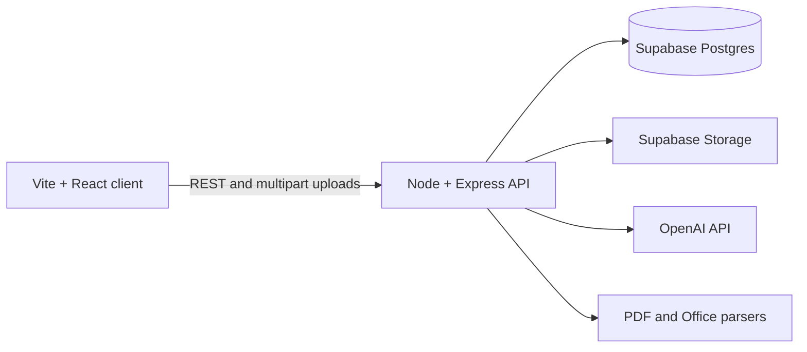
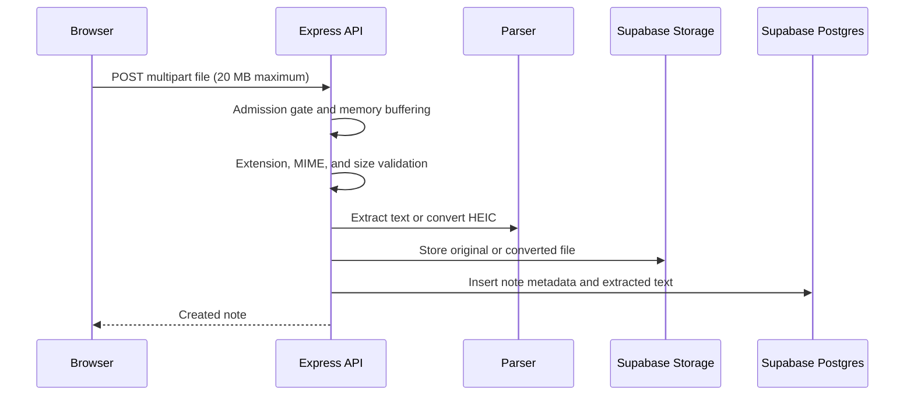
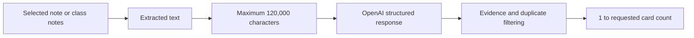

# ShelfStudy architecture

Last updated: 2026-08-30

This directory is the tracked architecture record for humans and coding
assistants. It describes what exists now, what is intentionally temporary, and
the approved direction for production. Future work is a plan, not permission to
implement every phase at once.

## Current system



- The React client lives in `client/` and calls `/api/*` through `client/src/api.ts`.
- The Express API lives in `server/`.
- Supabase Postgres stores folders, classes, note metadata, and extracted text.
- Supabase Storage stores original uploads. The current bucket uses public URLs;
  production requires authentication, a private bucket, and access policies.
- OpenAI generates chat responses, quizzes, and grounded flashcards.
- There is no production authentication, job queue, container deployment, or
  cross-user authorization yet.

## Current upload pipeline



The API currently accepts at most `MAX_CONCURRENT_UPLOADS` uploads per process,
defaulting to 3. Additional uploads receive `503 Service Unavailable` and a
`Retry-After: 5` header. Oversized multipart requests receive `413`. This limits
damage from concurrent in-memory parsing, but it is not the final scaling design.

Current weaknesses:

- `multer.memoryStorage()` keeps each accepted file in API memory.
- Extraction happens synchronously before the request finishes.
- A slow or complex Office file occupies an upload slot longer than an image.
- The per-process limit multiplies when more API replicas are added.
- There is no authenticated per-user quota or ownership check.

## Current Office preview

- PPTX/PPT files are parsed on preview open and rendered from their real slide
  boundaries with Previous and Next navigation.
- DOCX files are converted to formatted HTML and divided into page-style sections.
  DOCX pagination is approximate because Word calculates much of its layout at
  render time rather than storing stable page boundaries.
- PDF files use the browser PDF viewer.
- Images use the browser image renderer.
- HTML notes are fetched and rendered in a sandboxed frame.
- Office previews are generated again when reopened; no durable preview artifact
  or cache exists yet.

The current approach is appropriate for upload and flashcard development. It is
not expected to reproduce PowerPoint animations, transitions, embedded video,
macros, or every complex chart.

## Current flashcard pipeline



The model must return evidence copied from the source. Unsupported or repeated
cards are removed. Returning fewer cards than requested is valid when at least
one grounded card remains. Generated sets are not persisted or cached, so repeated
generation currently creates another model request.

## Decisions in force

1. Keep Supabase for the current upload and flashcard phase.
2. Keep the application upload limit at 20 MB while uploads use server memory.
3. Do not add AWS or Kubernetes merely for appearance; each service must solve a
   documented operational problem.
4. Use Vercel for the frontend if desired, but do not proxy large file bodies
   through Vercel Functions.
5. The production file pipeline will upload directly to object storage and move
   parsing, preview conversion, and AI preparation to background workers.
6. Supabase Postgres and Auth may remain even if object storage and compute move
   to AWS.

## Operational sizing model

Storage is estimated from behavior, not user count alone:

```text
stored data = active users × files per user × average stored file size
```

Example: `100 × 10 × 5 MB` is approximately 5 GB before generated previews,
versions, and backups. Production capacity planning must also include download
bandwidth, AI usage, database connections, parsing CPU, and peak concurrent
uploads.

## References

- [Supabase Storage](https://supabase.com/docs/guides/storage)
- [Supabase resumable uploads](https://supabase.com/docs/guides/storage/uploads/resumable-uploads)
- [Vercel Function limits](https://vercel.com/docs/functions/limitations)
- [Amazon S3 presigned uploads](https://docs.aws.amazon.com/AmazonS3/latest/userguide/PresignedUrlUploadObject.html)
